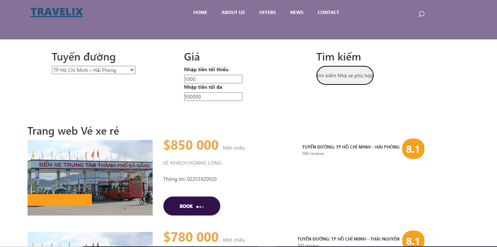
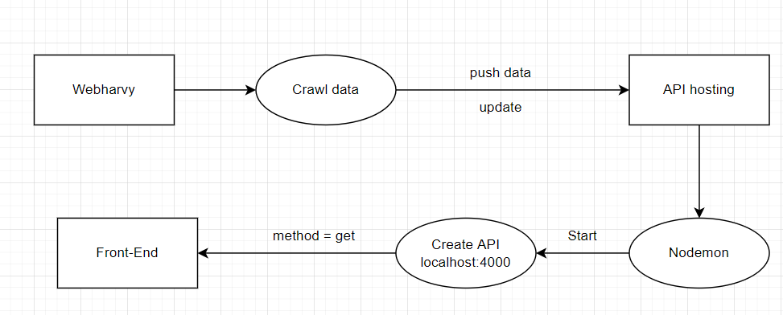

# Get price of ticket information project



## talk about the project

* we create two project(Back end and front end)

* We crawl data from 3 website


1. API Hosting
This project to crawl data from 3 website and save it, after that with <font color="gree">nodemon</font> <https://www.npmjs.com/package/nodemon>
we will start project and api will be reload,



## How to run?

### Front-end project

* <https://github.com/ngotron/Reactjs_Project_BusTicket/tree/master>
* Because the node_modules so strong, therefor I can not push it on github, i use .gitignore to un-push node_modules.
Please write:
<font color="gree">npm i</font>
to install node_modules.
and to run write: <font color="gree">npm start</font>

### Back-end project

* <https://github.com/tranvanhieu01012002/api-hosting>
* Because the node_modules so strong, therefor I can not push it on github, i use .gitignore to un-push node_modules.

* config package.json file

```
npm init
```

* Please write to install node_modules

```
npm i
```

* install json server

```
npm install -g json-server
```

To install nodemon

```
npm install --save-dev nodemon
```

and to run:

```
npm run dev
```

### Note

* Front end run on port:3000

* Back end run on port:4000

* Therefor if you have any app run in to port, please turn off it.

### Demo video
